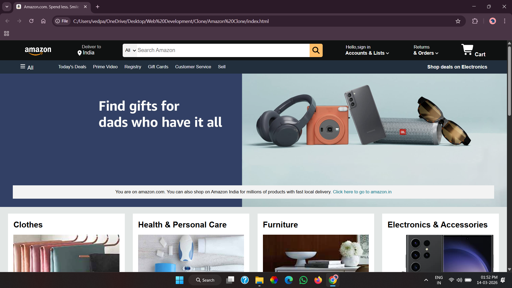
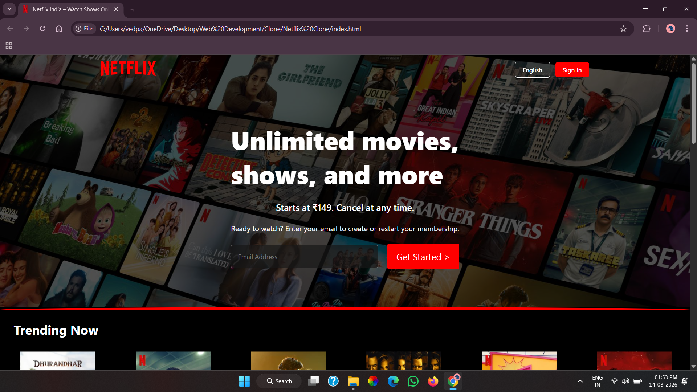

# 🎬 Netflix & 🛒 Amazon UI Clones

This repository contains UI clones of Netflix and Amazon built using only HTML and CSS.

These projects were created for frontend practice to improve layout design, styling, and UI recreation skills.

---

## 📌 Projects Included

### 1️⃣ Netflix Clone
- Static homepage UI clone
- Built using HTML and CSS
- Focused on layout structure and styling

### 2️⃣ Amazon Clone
- Static homepage UI clone
- Built using HTML and CSS
- Practiced positioning and section layouts

---

## 🛠️ Technologies Used

- HTML5
- CSS3

---

## 🎯 Purpose of This Repository

- Practice frontend fundamentals
- Improve layout structuring skills
- Understand real-world website design patterns
- Strengthen CSS styling concepts

---

## 🚀 Future Improvements

- Make the websites responsive
- Add more sections
- Improve UI accuracy
- Add hover effects and animations

---

## 📷 Preview

You can open the `index.html` file in your browser to view the projects locally.

###  Amazon Clone

###  Netflix Clone

---

## 👨‍💻 Author

Vedant  
Frontend Developer (Learning Phase 🚀)
